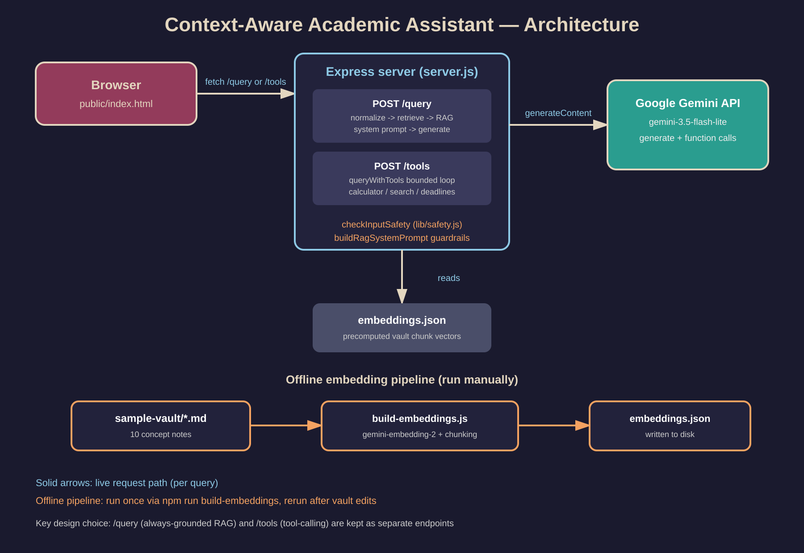

# Architecture



## System diagram (text form)

```
[Browser: public/index.html]
      |
      | fetch('/query') or fetch('/tools')
      v
[Express server: server.js]
      |
      |-- POST /query --------------------+
      |     1. normalizeQuery (lib/utils.js)
      |     2. retrieveRelevantChunks (lib/rag.js)
      |          -> reads embeddings.json (precomputed)
      |     3. buildRagSystemPrompt (lib/rag.js)
      |     4. ai.models.generateContent (Gemini)
      |     5. tool-call loop if functionCalls present
      |             -> executeTool (lib/tools.js)
      v
      |-- POST /tools --------------------+
      |     1. queryWithTools (lib/tools.js)
      |     2. ai.models.generateContent with
      |          [calculatorTool, searchKnowledgeBaseTool, deadlinesTool]
      |     3. bounded loop (max 4 rounds) executing tool calls
      v
[Google Gemini API: gemini-3.5-flash-lite]

[Offline pipeline, run manually via npm scripts]
[sample-vault/*.md] --> scripts/build-embeddings.js --> [embeddings.json]
                              (gemini-embedding-2)
```

## Data flow for a RAG question
1. User types a question in the browser, selects "Ask RAG" mode.
2. Browser POSTs `{ prompt, base64Image?, mimeType? }` to `/query`.
3. Server embeds the query, computes cosine similarity against every
   pre-embedded vault chunk in `embeddings.json`, takes the top 3.
4. Those chunks are injected into a system prompt (`buildRagSystemPrompt`)
   that instructs the model to answer only from that context and cite
   the source file.
5. Gemini responds; if it requests a tool (calculator, deadlines, search),
   the server executes it locally and sends the result back for a final
   answer.
6. Server returns `{ response, sources }` to the browser.

## Key design decision
RAG (`/query`) and tool-calling (`/tools`) are kept as separate endpoints
per the Session 11 architecture note, rather than merging them, so the
always-grounded RAG behavior isn't accidentally weakened by giving the
model discretion over whether to retrieve.

